# AI-Powered Agentic Workflow for Project Management

An AI-driven project management framework that transforms product specifications into actionable development plans using a library of reusable, composable AI agents. The system generates user stories, product features, and detailed engineering tasks from any product spec through a multi-step orchestrated workflow.

**Pilot implementation:** InnovateNext Solutions' Email Router product specification.

---

## Architecture




---

## Project Structure

```
ai-powered-agentic-workflow/
│
├── src/
│   ├── workflow_agents/                        # Reusable agent library
│   │   ├── __init__.py                         # Package exports for all agents
│   │   ├── direct_prompt/
│   │   │   ├── __init__.py
│   │   │   └── agent.py                        # DirectPromptAgent
│   │   ├── augmented_prompt/
│   │   │   ├── __init__.py
│   │   │   └── agent.py                        # AugmentedPromptAgent
│   │   ├── knowledge_augmented_prompt/
│   │   │   ├── __init__.py
│   │   │   └── agent.py                        # KnowledgeAugmentedPromptAgent
│   │   ├── rag_knowledge_prompt/
│   │   │   ├── __init__.py
│   │   │   └── agent.py                        # RAGKnowledgePromptAgent
│   │   ├── evaluation/
│   │   │   ├── __init__.py
│   │   │   └── agent.py                        # EvaluationAgent
│   │   ├── routing/
│   │   │   ├── __init__.py
│   │   │   └── agent.py                        # RoutingAgent
│   │   └── action_planning/
│   │       ├── __init__.py
│   │       └── agent.py                        # ActionPlanningAgent
│   └── agentic_workflow.py                     # Orchestration workflow script
│
├── tests/
│   └── agents/                                 # Individual agent test scripts
│       ├── test_direct_prompt_agent.py
│       ├── test_augmented_prompt_agent.py
│       ├── test_knowledge_augmented_prompt_agent.py
│       ├── test_rag_knowledge_prompt_agent.py
│       ├── test_evaluation_agent.py
│       ├── test_routing_agent.py
│       └── test_action_planning_agent.py
│
├── data/
│   └── specs/
│       └── Product-Spec-Email-Router.txt       # Email Router product specification
│
├── output/
│   └── complete-workflow-output.txt            # Sample workflow run output
│
├── docs/
│   ├── project_overview.md
│   └── screenshots/                            # Test run evidence
│
├── .env.example
├── .gitignore
├── requirements.txt
└── README.md
```

---

## Agent Library

Each agent lives in its own module under `src/workflow_agents/` and can be imported individually or through the top-level package:

```python
# Import individual agents
from src.workflow_agents import DirectPromptAgent, EvaluationAgent

# Or import from their modules directly
from src.workflow_agents.routing import RoutingAgent
```

| Agent | Module | Description |
|---|---|---|
| **DirectPromptAgent** | `direct_prompt/` | Passes user input directly to the LLM — no system prompt, no context |
| **AugmentedPromptAgent** | `augmented_prompt/` | Adopts a configurable persona via system prompt for targeted responses |
| **KnowledgeAugmentedPromptAgent** | `knowledge_augmented_prompt/` | Combines a persona with explicit domain knowledge, overriding the LLM's training data |
| **RAGKnowledgePromptAgent** | `rag_knowledge_prompt/` | Chunks text, calculates embeddings, retrieves the most relevant chunk to answer queries |
| **EvaluationAgent** | `evaluation/` | Iterative evaluator — checks a worker agent's output against criteria and refines through feedback loops |
| **RoutingAgent** | `routing/` | Routes prompts to the best-matched agent using embedding-based semantic similarity |
| **ActionPlanningAgent** | `action_planning/` | Extracts ordered action steps from a prompt using a provided knowledge base |

---

## Workflow Pipeline

The orchestration script (`src/agentic_workflow.py`) chains agents into a multi-step workflow:

1. **ActionPlanningAgent** breaks the TPM's high-level prompt into sub-tasks
2. **RoutingAgent** directs each sub-task to the appropriate team
3. **Product Manager team** — `KnowledgeAugmentedPromptAgent` + `EvaluationAgent` → validated user stories
4. **Program Manager team** — `KnowledgeAugmentedPromptAgent` + `EvaluationAgent` → validated product features
5. **Development Engineer team** — `KnowledgeAugmentedPromptAgent` + `EvaluationAgent` → validated engineering tasks

A sample output from the Email Router pilot is in `output/complete-workflow-output.txt`.

---

## Getting Started

### Prerequisites

- Python 3.10+
- An OpenAI API key

### Installation

```bash
git clone https://github.com/zcoulibalyeng/ai-powered-agentic-workflow.git
cd ai-powered-agentic-workflow

python -m venv venv
source venv/bin/activate        # macOS/Linux
# venv\Scripts\activate         # Windows

pip install -r requirements.txt

cp .env.example .env
# Add your OpenAI API key to .env
```

### Running Agent Tests

Run individual agent tests from the project root:

```bash
python -m tests.agents.test_direct_prompt_agent
python -m tests.agents.test_augmented_prompt_agent
python -m tests.agents.test_knowledge_augmented_prompt_agent
python -m tests.agents.test_rag_knowledge_prompt_agent
python -m tests.agents.test_evaluation_agent
python -m tests.agents.test_routing_agent
python -m tests.agents.test_action_planning_agent
```

### Running the Full Workflow

```bash
python -m src.agentic_workflow
```

---

## License

See [LICENSE](LICENSE) for details.
